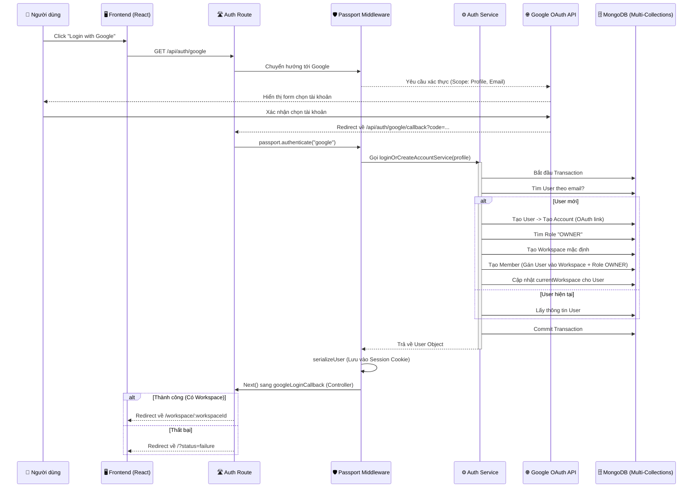

# 📑 Tài liệu Kỹ thuật: Module Google OAuth Authentication

## 1. Sơ đồ luồng (Sequence Diagram)
Dưới đây là hành trình của một yêu cầu đăng nhập từ lúc người dùng click chuột cho đến khi vào được Workspace.

---

## 2. Các rẽ nhánh (Decision Branches)

### Nhánh A: Đăng ký (New User) vs Đăng nhập (Existing User)
*   **Xử lý tại:** `src/services/auth.service.ts`
*   **Cơ chế:** Dùng `UserModel.findOne({ email })`.
*   **Nếu mới:** Thực hiện 5 bước nguyên tử (Atomic) trong một **Transaction**. Nếu 1 bước lỗi (ví dụ: thiếu Role OWNER), toàn bộ dữ liệu sẽ được rút lại (Rollback), không tạo ra User "rác".
*   **Nếu cũ:** Lấy thông tin User hiện tại và trả về, không tạo thêm dữ liệu mới.

### Nhánh B: Thành công vs Thất bại khi Callback
*   **Xử lý tại:** `src/routes/auth.route.ts` và `src/controllers/auth.controller.ts`
*   **Thất bại (Lỗi từ Google/Passport hoặc User từ chối):** Chuyển hướng về Frontend kèm tham số URL `?status=failure`.
*   **Thành công (Passport xác thực xong):** Chạy tiếp vào `googleLoginCallback`. Tại đây kiểm tra `req.user.currentWorkspace`:
    *   Nếu có: Trình duyệt được Redirect về trang Workspace cụ thể (`/workspace/:workspaceId`).
    *   Nếu không (Trường hợp hy hữu lỗi data): Redirect về trang báo lỗi của Frontend.

---

## 3. Công dụng của các thành phần chính

| Thành phần | File | Công dụng |
| :--- | :--- | :--- |
| **Route Path** | `src/routes/auth.route.ts` | Cổng vào `/google` và cổng phản hồi `/google/callback`. Khai báo chuỗi middleware. |
| **Strategy Config** | `src/config/passport.config.ts` | "Bộ não" kết nối với Google. Định nghĩa các cấu hình ClientID, Secret và hàm callback lấy `email`, `id` từ Google rồi nạp vào Service của mình. |
| **Transaction Service** | `src/services/auth.service.ts` | Đảm bảo tính nhất quán của dữ liệu. Đăng ký tài khoản tuân thủ ACID transaction (có đủ User, Account, Workspace, Role). |
| **Session Control** | `src/index.ts` | Khởi tạo `cookie-session` để ghi "nhãn dán" người dùng vào trình duyệt, duy trì trạng thái đăng nhập. |
| **Type Augmentation** | `src/@types/express/index.d.ts` | Giúp TypeScript hiểu rằng `req.user` không phải là một object rỗng mà là một UserDocument có đầy đủ các trường dữ liệu (mở rộng type). |

---

## 4. Giải mã các đoạn code "Sống còn"

1.  **`passport.authenticate("google", { scope: ["profile", "email"] })`**
    *   *Ý nghĩa:* Yêu cầu Google cấp quyền truy cập vào thông tin cơ bản: tên, ảnh đại diện và địa chỉ email của người dùng. Không lấy quá nhiều quyền không cần thiết.

2.  **`dbSession.startTransaction()`**
    *   *Ý nghĩa:* "Khóa" khối làm việc với cơ sở dữ liệu. Mọi thay đổi dữ liệu từ lúc này đều là tạm thời. Nếu có bất kỳ lỗi nào, gọi `abortTransaction()` để xóa sạch. Nếu suôn sẻ, gọi `commitTransaction()` để lưu chính thức. Rất quan trọng cho luồng tạo tài khoản đi kèm Workspace.

3.  **`passport.serializeUser` và `deserializeUser`**
    *   *Ý nghĩa:* 
        *   `serializeUser`: Quyết định cất giữ thông tin gì của User vào session cookie sau khi đăng nhập thành công.
        *   `deserializeUser`: Ở các request tiếp theo của user, lấy thông tin từ session cookie ra và phục hồi lại đối tượng `req.user`.

4.  **`res.redirect(...)`**
    *   *Ý nghĩa:* Cú "đẩy" người dùng từ Backend sang Frontend. Vì OAuth là luồng đăng nhập di chuyển giữa các Domain khác nhau (Frontend -> Backend -> Google -> Backend -> Frontend), chúng ta không dùng `res.json` được mà phải dùng `redirect`.
