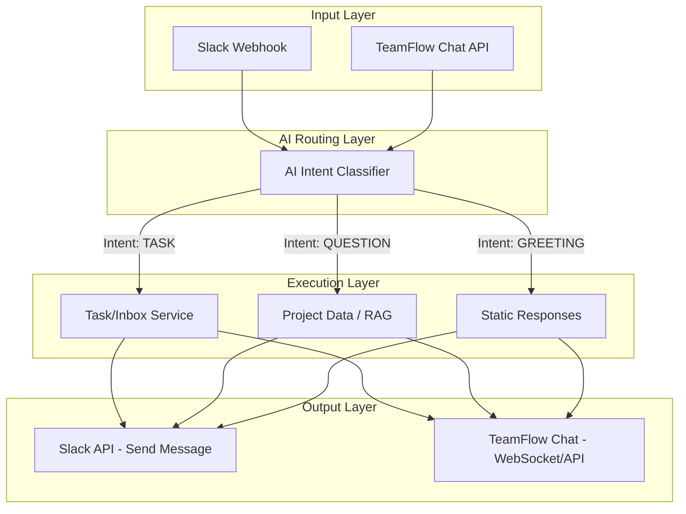

# Đề xuất Kiến trúc AI Thông minh Đa kênh (Slack & TeamFlow Chat)

Tài liệu này phác thảo cách tái sử dụng và mở rộng hệ thống AI hiện có (Groq/Nvidia) của TeamFlow để xây dựng một **"Trợ lý AI đa kênh"** (Omnichannel AI Assistant). Trợ lý này không chỉ biết tạo Task một cách máy móc, mà còn có khả năng **hiểu ngữ cảnh** để phản hồi linh hoạt.

---

## 1. Mục tiêu (Objectives)
*   **Tái sử dụng code (DRY - Don't Repeat Yourself):** Dùng chung một "bộ não AI" (AI Service) cho cả Slack Bot và In-app Chat của TeamFlow.
*   **Phân loại ý định (Intent Classification):** AI có khả năng đọc tin nhắn và quyết định xem người dùng đang muốn:
    *   Tạo công việc mới (TASK).
    *   Hỏi thông tin dự án (QUESTION).
    *   Chỉ là chào hỏi xã giao (GREETING/CHITCHAT).
*   **Trải nghiệm người dùng (UX):** Mang lại cảm giác đang nói chuyện với một Project Manager thực thụ.

---

## 2. Kiến trúc Tổng thể (Architecture)

Kiến trúc sẽ bao gồm 4 tầng (Layers) chính:



---

## 3. Các bước Triển khai chi tiết (Implementation Steps)

### Bước 1: Nâng cấp `ai.service.ts` (Tạo bộ não phân loại)
Chúng ta sẽ viết thêm một hàm mới sử dụng prompt engineering cực nhẹ để LLM chỉ trả về một từ khóa duy nhất đại diện cho Intent.

```typescript
// backend/src/services/ai.service.ts
export const classifyIntentService = async (message: string): Promise<string> => {
    const prompt = `
Bạn là một AI phân tích ngôn ngữ tự nhiên. 
Nhiệm vụ của bạn là đọc tin nhắn của người dùng và phân loại nó vào đúng MỘT TRONG BA danh mục sau:

1. "TASK": Nếu người dùng muốn tạo công việc, nhắc nhở, hoặc yêu cầu làm một việc gì đó (VD: "Nhớ họp lúc 3h", "Tạo task fix bug đăng nhập", "Mua trà sữa").
2. "QUESTION": Nếu người dùng đang hỏi thông tin (VD: "Hôm nay có bao nhiêu task chưa xong?", "Dự án A đến đâu rồi?").
3. "GREETING": Nếu chỉ là chào hỏi, cảm ơn hoặc nói chuyện phiếm (VD: "Hello", "Cảm ơn nhé", "Chào buổi sáng").

Tin nhắn: "${message}"

Tuyệt đối CHỈ TRẢ VỀ ĐÚNG 1 TỪ (TASK, QUESTION, hoặc GREETING), không giải thích thêm.
`;

    // Gọi Groq/Nvidia như các hàm đã có
    const completion = await getGroqClient().chat.completions.create({
        messages: [{ role: "user", content: prompt }],
        model: AI_MODELS.GROQ_LLAMA_3_3_70B,
        temperature: 0.1, // Nhiệt độ thấp để kết quả ổn định, không sáng tạo
    });

    return completion.choices[0]?.message?.content?.trim().toUpperCase() || "TASK"; // Default fallback
};
```

### Bước 2: Tích hợp vào Webhook (Slack)
Cập nhật file `webhook.controller.ts` để chặn tin nhắn và đưa qua "bộ não" trước khi quyết định làm gì.

```typescript
// backend/src/controllers/webhook.controller.ts
import { classifyIntentService, chatWithContextService } from "../services/ai.service";
import { SlackService } from "../services/slack.service";

// Bỏ qua phần code xác thực user...

const messageText = req.body.event.text;

// 1. Phân loại ý định
const intent = await classifyIntentService(messageText);

// 2. Xử lý theo ý định
switch (intent) {
    case "TASK":
        // Logic cũ: Lưu vào Inbox
        await createDraftService(dbUser._id.toString(), {
            title: messageText,
            sourceType: "SLACK"
        });
        // Báo cho user biết đã lưu
        await SlackService.sendMessage(webhookUrl, "✅ Đã ghi nhận công việc vào Inbox TeamFlow của bạn.");
        break;

    case "QUESTION":
        // Lấy ngữ cảnh dự án (nếu có) và hỏi AI
        const answer = await chatWithContextService(messageText, [], projectContext);
        await SlackService.sendMessage(webhookUrl, answer);
        break;

    case "GREETING":
        await SlackService.sendMessage(webhookUrl, "👋 Chào bạn! Tôi là trợ lý TeamFlow. Tôi có thể giúp gì cho bạn hôm nay?");
        break;

    default:
        // Xử lý mặc định
        break;
}
```

### Bước 3: Tích hợp vào TeamFlow Chat (Giao diện ứng dụng)
Tương tự như Slack, khi người dùng chat trong khung AI Assistant trên web TeamFlow, API của bạn (ví dụ: `POST /api/ai/chat`) cũng gọi đúng hàm `classifyIntentService` đó.
*   Nếu là `TASK`, giao diện web sẽ hiện một Card hỏi "Bạn có muốn lưu nội dung này vào Inbox không?".
*   Nếu là `QUESTION`, giao diện chat trả lời như ChatGPT bình thường.

---

## 4. Lợi ích của Kiến trúc này (Benefits)

1.  **Dễ bảo trì:** Logic AI nằm tập trung tại `ai.service.ts`. Khi bạn muốn AI thông minh hơn, bạn chỉ sửa 1 nơi, cả Slack và Web đều được hưởng lợi.
2.  **Mở rộng vô hạn:** Sau này bạn có thể thêm các Intent mới như `SUMMARIZE_DOCUMENT`, `SCHEDULE_MEETING`, v.v.
3.  **Chi phí thấp:** Phân loại ý định (Classification) tốn rất ít token và chạy cực nhanh (đặc biệt với Llama 3 trên Groq), không làm tăng độ trễ (latency) của tin nhắn.

---

## 5. Định hướng Tương lai (RAG Integration)
Với Intent là `QUESTION`, để AI trả lời đúng dữ liệu của công ty (thay vì chém gió), bạn có thể áp dụng kỹ thuật **RAG (Retrieval-Augmented Generation)**:
1.  Người dùng hỏi: *"Dự án thiết kế Logo tiến độ đến đâu?"*
2.  Hệ thống query Database (Project, Task) tìm các từ khóa "Logo".
3.  Nhét dữ liệu tìm được vào Context của AI.
4.  AI đọc dữ liệu và trả lời: *"Dự án Logo đang ở Phase 2, còn 3 task chưa hoàn thành..."*

**Kết luận:** Bạn đang sở hữu một nền tảng rất tốt (`ai.service.ts` đã setup sẵn Groq/Nvidia). Việc nâng cấp này hoàn toàn khả thi và có thể làm trong 1-2 Sprint tới!
