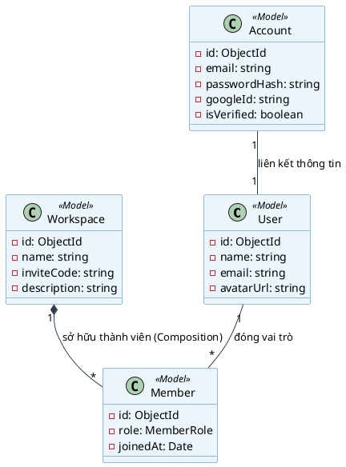

# BỘ QUY TẮC THIẾT KẾ SƠ ĐỒ LỚP (CLASS DIAGRAM) - TEAMFLOW

Tài liệu này cung cấp định nghĩa, mục đích và bộ quy tắc chuẩn hóa để xây dựng **Sơ đồ lớp (Class Diagram)** cho dự án **TeamFlow**. Hướng dẫn này được tối ưu hóa cho mô hình dự án sử dụng **TypeScript, Express và Mongoose ODM** để phù hợp với chuẩn báo cáo luận văn tốt nghiệp.

---

## 1. Class Diagram là gì và Mục đích sử dụng

### Class Diagram là gì?
Sơ đồ lớp (Class Diagram) là sơ đồ cấu trúc tĩnh quan trọng nhất trong UML (Unified Modeling Language). Nó mô tả hệ thống dưới dạng các **lớp (classes)**, các **thuộc tính (attributes)**, **phương thức (methods)** và **mối quan hệ (relationships)** giữa các lớp đó.

### Tại sao cần Class Diagram trong luận văn tốt nghiệp?
1. **Bản đồ cấu trúc dữ liệu:** Giúp Hội đồng chấm luận văn nhìn thấy ngay cấu trúc dữ liệu và các thực thể nghiệp vụ của hệ thống (User, Task, Project, Workspace...) có những thông tin gì.
2. **Thể hiện tính liên kết:** Chỉ ra mối quan hệ chặt chẽ giữa các bảng dữ liệu (ví dụ: Một dự án chứa nhiều công việc, một công việc thuộc về một thành viên).
3. **Cơ sở để sinh mã nguồn:** Là cầu nối trực tiếp giữa tài liệu phân tích thiết kế và mã nguồn thực tế (TypeScript Interfaces/Mongoose Schemas).

### Sự khác biệt giữa Class Diagram trong Java/C# và TypeScript/Node.js
* **Java/C# (OOP thuần):** Class Diagram thể hiện cả các lớp thực thể (Entity), lớp dịch vụ (Service), lớp giao diện (Controller) và cách chúng kế thừa lẫn nhau.
* **TypeScript/Mongoose (Dự án của chúng ta):** Tập trung tối đa vào **Class Diagram cho tầng dữ liệu (Data Models)** vì Node.js Express sử dụng cơ chế xuất module (module-based). Việc vẽ hàng chục class Controller/Route không mang lại nhiều giá trị thiết kế mà làm sơ đồ cực kỳ rối. Do đó, quy tắc cốt lõi là **vẽ Class Diagram tập trung vào Models/Entities**.

### 1.4 Khóa chính (Primary Key) và Khóa ngoại (Foreign Key) trong Class Diagram
Trong chuẩn UML (Unified Modeling Language), **không có khái niệm Khóa chính (PK) hay Khóa ngoại (FK)** giống như trong Cơ sở dữ liệu quan hệ. Thay vào đó:
* **Khóa chính (Ví dụ `_id` trong MongoDB):** Được biểu diễn như một thuộc tính bình thường của lớp (ví dụ: `- id: ObjectId`). Không cần ký hiệu PK hay gạch chân.
* **Khóa ngoại (Ví dụ `projectId` trong Task):** Trong Class Diagram chuẩn, **không vẽ trường thuộc tính khóa ngoại** dưới dạng text bên trong hộp Class. Thay vào đó, mối quan hệ này được biểu diễn trực quan bằng **đường nối (mối quan hệ)** giữa hai Class, đi kèm với số lượng ở hai đầu (multiplicity, ví dụ `1` và `*`).
  * *Tại sao?* Ở tầng mã nguồn hướng đối tượng, ta truy cập liên kết bằng cách gọi `task.project` (trả về một Object Project) chứ không chỉ đơn thuần là một chuỗi ID. Đường nối UML thể hiện sự liên kết đối tượng này.

### 1.5 So sánh Class Diagram và ERD (Entity Relationship Diagram)
Hai sơ đồ này thường bị nhầm lẫn trong báo cáo luận văn. Dưới đây là bảng so sánh giúp bạn phân biệt rõ ràng:

| Đặc trưng | Class Diagram (Sơ đồ Lớp) | ERD (Sơ đồ Mối quan hệ Thực thể) |
| :--- | :--- | :--- |
| **Đối tượng mô tả** | Cấu trúc **Mã nguồn/Ứng dụng** (hướng đối tượng). | Cấu trúc **Cơ sở dữ liệu vật lý** (nơi lưu trữ). |
| **Thành phần cấu trúc** | Gồm **Attributes** (Thuộc tính) và **Methods** (Phương thức/Hành vi của đối tượng). | Chỉ gồm **Attributes** (Trường dữ liệu). **Không có phương thức**. |
| **Khóa chính / Khóa ngoại** | Không sử dụng ký hiệu PK/FK. Mô tả bằng quan hệ đối tượng. | Bắt buộc định nghĩa rõ **PK (Primary Key)** và **FK (Foreign Key)**. |
| **Mối quan hệ hỗ trợ** | Hỗ trợ các quan hệ OOP phức tạp: Kế thừa (Inheritance), Thu nạp (Aggregation), Thành phần (Composition). | Chỉ hỗ trợ mối quan hệ liên kết dữ liệu quan hệ (1-1, 1-n, n-n). |
| **Sự phụ thuộc công nghệ** | Độc lập với loại database (MongoDB, SQL, file text đều dùng chung sơ đồ lớp). | Phụ thuộc vào loại CSDL quan hệ (SQL Server, MySQL, PostgreSQL). |

---

## 2. Quy tắc Ánh xạ từ Mongoose Schema sang UML Class

Mỗi Schema Mongoose trong thư mục `backend/src/models/` sẽ được ánh xạ thành một lớp trong sơ đồ.

```
┌──────────────────────────────────────────┐
│              <<Model>>                   │  <-- Stereotype thể hiện đây là Data Model
│               User                       │  <-- Tên Class (viết hoa chữ cái đầu)
├──────────────────────────────────────────┤
│ - name: string                           │  <-- Thuộc tính (Dấu trừ '-' thể hiện Private/Protected)
│ - email: string                          │
│ - avatarUrl: string                      │
├──────────────────────────────────────────┤
│ + getActiveWorkspaces(): Promise<void>   │  <-- Phương thức (Dấu cộng '+' thể hiện Public)
└──────────────────────────────────────────┘
```

### Quy tắc ký hiệu thuộc tính (Attributes):
* **Cú pháp:** `[phạm vi truy cập] tên_thuộc_tính : kiểu_dữ_liệu`
* **Phạm vi truy cập:** Trong Mongoose/TypeScript, mặc định dùng private `-` cho các thuộc tính trong database model để đảm bảo tính đóng gói (encapsulation).
* **Kiểu dữ liệu:** Sử dụng kiểu dữ liệu TypeScript chuẩn: `string`, `number`, `boolean`, `Date`, `ObjectId` (thay cho ref ID).

---

## 3. Quy tắc vẽ các mối quan hệ (Relationships)

Đây là phần quan trọng nhất để sơ đồ lớp có ý nghĩa khoa học. Ta sử dụng 3 mối quan hệ chính:

### A. Quan hệ Thuộc về / Liên kết (Association - Đường thẳng đơn)
* **Ý nghĩa:** Lớp này tham chiếu đến lớp kia nhưng không sở hữu vòng đời của nhau.
* **Ví dụ:** Lớp `Account` liên kết với lớp `User` (1-1).
* **Ký hiệu PlantUML:** `ClassA "1" -- "1" ClassB`

### B. Quan hệ Thu nạp (Aggregation - Hình thoi rỗng)
* **Ý nghĩa:** Quan hệ "chứa trong" (has-a). Một lớp chứa danh sách các lớp khác, nhưng khi lớp cha bị xóa, lớp con vẫn có thể tồn tại độc lập.
* **Ví dụ:** Lớp `Project` chứa nhiều `Task`. Nếu xóa dự án, các task có thể được chuyển sang hòm thư lưu trữ hoặc tồn tại dưới dạng lịch sử công việc độc lập.
* **Ký hiệu PlantUML:** `ParentClass "1" o-- "*" ChildClass` (Đầu hình thoi rỗng nằm ở phía lớp cha).

### C. Quan hệ Thành phần (Composition - Hình thoi đặc)
* **Ý nghĩa:** Quan hệ sở hữu tuyệt đối. Lớp con phụ thuộc hoàn toàn vào vòng đời của lớp cha. Nếu xóa cha, con bắt buộc bị xóa theo (Cascade Delete).
* **Ví dụ:** Lớp `Workspace` và lớp `Member`. Nếu xóa không gian làm việc (`Workspace`), toàn bộ bản ghi thành viên (`Member`) của workspace đó không còn lý do tồn tại độc lập $\rightarrow$ Xóa sạch.
* **Ký hiệu PlantUML:** `ParentClass "1" *-- "*" ChildClass` (Đầu hình thoi đặc nằm ở phía lớp cha).

---

## 4. Danh sách các Lớp (Models) chính cần thể hiện

Sơ đồ lớp của TeamFlow sẽ bao gồm các thực thể chính sau:

1. **Account:** Lưu thông tin tài khoản đăng nhập (email, password băm, status, googleId).
2. **User:** Lưu thông tin cá nhân hiển thị (tên, avatar, email liên hệ).
3. **Workspace:** Không gian làm việc chung (tên, mô tả, mã mời inviteCode, ownerId).
4. **Member:** Đại diện liên kết giữa User và Workspace, lưu vai trò (`OWNER`, `ADMIN`, `MEMBER`) trong workspace đó.
5. **Project:** Các dự án trong Workspace.
6. **Phase:** Các giai đoạn của dự án (mỗi dự án có nhiều Phase).
7. **Task:** Công việc cụ thể thuộc về Project và Phase (tên, mô tả, assigneeId, priority, status).
8. **TaskDependency:** Lưu quan hệ ràng buộc (Task A chặn Task B).
9. **ActivityLog / AuditTrail:** Ghi lại lịch sử thao tác của các thành viên.

---

## 5. Ví dụ mã nguồn PlantUML mẫu cho Class Diagram

Dưới đây là một đoạn mã PlantUML mẫu thiết kế Class Diagram theo bộ quy tắc trên:


