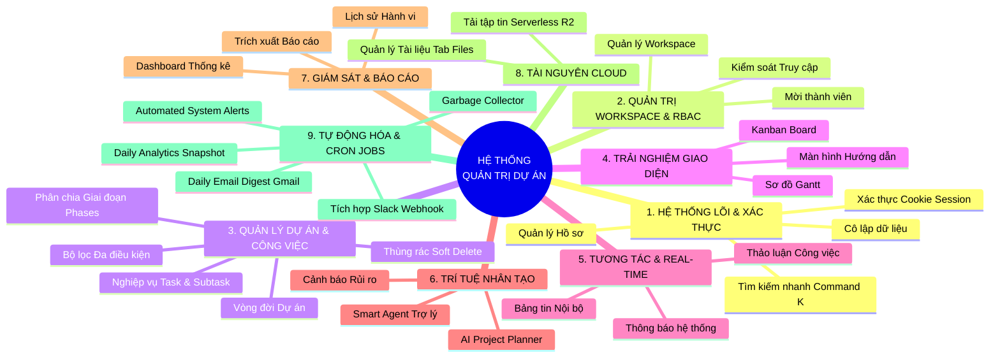

# SƠ ĐỒ PHÂN CẤP CHỨC NĂNG (BFD) - CẬP NHẬT MỚI NHẤT
*Bản sửa đổi dựa trên cấu trúc 9 Phân hệ thực tế của hệ thống.*

## 1. Những điểm sai sót của biểu đồ cũ:
1. **Thiếu tính năng:** AI cũ còn ghi "Roadmap Visualizer" (đã bỏ) và thiếu các tính năng AI hạng nặng như "AI Project Planner" và "Smart Agent (Tool Calling)".
2. **Sai nhóm chức năng:** Nhét "Cleanup Cron Job" chung với Cloud. Ở kiến trúc mới, chúng ta đã tách hẳn một nhánh số 9 là **Tự động hóa & Background Services** để tôn vinh hệ thống chạy ngầm.
3. **Gộp nhánh không hợp lý:** Nhánh 3 và 4 ở bản cũ hơi lộn xộn. Bản mới đã chuẩn hóa lại thành "Quản lý Dự án & Công việc" và tách "Kanban" ra thành phân hệ "Trải nghiệm Giao diện".

---

## 2. Cấu trúc BFD Mới (Dùng để vẽ lại trên Draw.io / Visio)

**HỆ THỐNG QUẢN TRỊ DỰ ÁN TẬP TRUNG**

*   **1. HỆ THỐNG LÕI & XÁC THỰC**
    *   Xác thực Cookie Session (Auth)
    *   Quản lý Hồ sơ (Profile)
    *   Cô lập dữ liệu (Multi-tenancy)
    *   Tìm kiếm nhanh (Command K)
*   **2. QUẢN TRỊ WORKSPACE & PHÂN QUYỀN (RBAC)**
    *   Quản lý Workspace
    *   Mời thành viên (Invite Link)
    *   Kiểm soát Truy cập (Owner/Admin/Member)
*   **3. QUẢN LÝ DỰ ÁN & CÔNG VIỆC**
    *   Vòng đời Dự án (Create/Freeze)
    *   Phân chia Giai đoạn (Phases)
    *   Nghiệp vụ Task & Subtask
    *   Bộ lọc Đa điều kiện
    *   Thùng rác (Soft Delete)
*   **4. TRẢI NGHIỆM GIAO DIỆN (UI)**
    *   Kanban Board
    *   Sơ đồ Gantt (Gantt Chart)
    *   Màn hình Hướng dẫn (Empty States)
*   **5. TƯƠNG TÁC & REAL-TIME**
    *   Thông báo hệ thống (Sockets)
    *   Thảo luận Công việc (Comments)
    *   Bảng tin Nội bộ (Announcements)
*   **6. TRÍ TUỆ NHÂN TẠO (AI)**
    *   AI Project Planner (Phân rã DA)
    *   Smart Agent (Trợ lý tự trị)
    *   Phân tích Cảnh báo Rủi ro
*   **7. GIÁM SÁT & BÁO CÁO**
    *   Dashboard Thống kê
    *   Lịch sử Hành vi (Audit Log)
    *   Trích xuất Báo cáo (Excel)
*   **8. TÀI NGUYÊN CLOUD**
    *   Tải tập tin Serverless (R2)
    *   Quản lý Tài liệu Tập trung (Tab Files)
*   **9. TỰ ĐỘNG HÓA & CRON JOBS**
    *   Garbage Collector (Dọn rác)
    *   Daily Analytics Snapshot
    *   Daily Email Digest (Báo cáo Gmail)
    *   Tích hợp Slack Webhook động
    *   Automated System Alerts

---

## 3. Sơ đồ Mermaid (Tạo nhanh BFD trực quan)
*Bạn có thể copy đoạn mã dưới đây dán vào [Mermaid Live Editor](https://mermaid.live) để ra hình ngay lập tức.*

