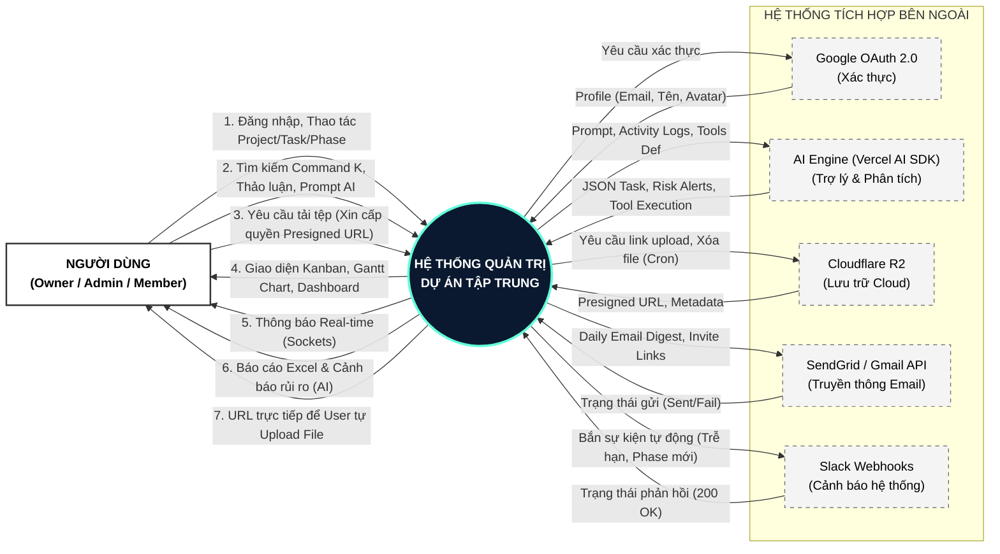

# SƠ ĐỒ NGỮ CẢNH HỆ THỐNG (SYSTEM CONTEXT DIAGRAM)

Sơ đồ ngữ cảnh (Context Diagram) là mức cao nhất trong mô hình dòng dữ liệu (DFD mức 0). Sơ đồ này cho thấy cái nhìn tổng quan nhất về hệ thống, bao gồm một tiến trình duy nhất đại diện cho toàn bộ phần mềm **Hệ thống Quản trị Dự án Tập trung**, và các thực thể (tác nhân) bên ngoài tương tác với nó.

Mô hình kiến trúc của hệ thống bao gồm 3 thành phần cốt lõi:
1. **Tác nhân Người dùng (User Actors)**
2. **Hệ thống Trung tâm (Core System)**
3. **Các hệ thống tích hợp bên ngoài (External 3rd-party APIs)**

---

## 1. Luồng dữ liệu giữa NGƯỜI DÙNG và HỆ THỐNG

Tác nhân người dùng bao gồm 3 phân quyền chính trong một Không gian làm việc (Workspace): **Owner**, **Admin**, và **Member**. 

### 1.1. Luồng dữ liệu VÀO hệ thống (Input)
*   **Thông tin Đăng nhập/Xác thực:** Yêu cầu đăng nhập Local (Email/Password) hoặc thông qua Google OAuth.
*   **Lệnh thao tác Quản lý (CRUD):** Yêu cầu tạo mới, chỉnh sửa, hoặc xóa đối với Workspace, Project, Phase và Task.
*   **Tra cứu và Tìm kiếm:** Truy vấn tìm kiếm toàn cục (Command K) hoặc lọc dữ liệu (Filter).
*   **Tương tác & Truyền thông:** Bình luận (Comments) trong tác vụ, đăng tải thông tin lên Bảng tin nội bộ (Announcements).
*   **Tương tác Trợ lý AI:** Gửi các câu lệnh (Prompt) và ngữ cảnh công việc yêu cầu AI phân tích.
*   **Tải lên Tệp tin (File Upload):** Gửi yêu cầu xin cấp quyền tải lên tệp tin tài liệu dự án.

### 1.2. Luồng dữ liệu RA từ hệ thống (Output)
*   **Giao diện & Dữ liệu Trực quan:** Render màn hình làm việc dưới dạng Kanban Board, Sơ đồ Gantt (Gantt Chart), và các Dashboard Thống kê.
*   **Thông báo Real-time:** Bắn tín hiệu WebSocket (Socket.io) về trình duyệt để cập nhật trạng thái ngay lập tức khi có sự kiện thay đổi.
*   **Báo cáo & Phân tích:** File báo cáo xuất ra dưới định dạng Excel, kèm theo các cảnh báo rủi ro (Risk Alerts) do AI sinh ra.
*   **Quyền truy cập Cloud (Presigned URL):** Trả về URL được ký duyệt bảo mật tạm thời để trình duyệt tự động upload file trực tiếp lên Cloud.

---

## 2. Luồng dữ liệu giữa HỆ THỐNG và TÍCH HỢP BÊN NGOÀI

Để đảm bảo hiệu năng và đáp ứng kiến trúc hiện đại, hệ thống cốt lõi không tự xử lý toàn bộ mà ủy thác các nghiệp vụ đặc thù cho các nền tảng chuyên biệt (SaaS/Cloud).

*   **Google OAuth 2.0 (Dịch vụ Xác thực):**
    *   *System -> Google:* Yêu cầu xác thực tài khoản bên thứ 3.
    *   *Google -> System:* Trả về Token và thông tin User Profile (Email, Tên, Avatar mặc định).
*   **Vercel AI SDK / OpenAI / Gemini (Trợ lý & Phân tích):**
    *   *System -> AI Engine:* Truyền Prompt ngữ cảnh, Activity Logs (Nhật ký hoạt động) và định nghĩa công cụ (Tools Definition).
    *   *AI Engine -> System:* Trả về JSON cấu trúc rành mạch (Phân rã Task), kết quả thực thi Tool Calling, hoặc văn bản đánh giá rủi ro dự án.
*   **Cloudflare R2 (Lưu trữ Serverless Object Storage):**
    *   *System -> R2:* Gửi yêu cầu sinh link Upload/Download an toàn; Gửi lệnh xóa vật lý tệp tin từ Background Cron Job (Garbage Collector).
    *   *R2 -> System:* Trả về Presigned URL và Metadata tệp tin (Dung lượng, định dạng).
*   **SendGrid / Gmail API (Dịch vụ Truyền thông Email):**
    *   *System -> Email Provider:* Chuyển tiếp các mẫu thư Daily Email Digest (Báo cáo hằng ngày), Invite Links (Link mời), hoặc Reset Password.
    *   *Email Provider -> System:* Phản hồi trạng thái gửi thư (Sent / Failed).
*   **Slack Webhooks (Tích hợp Cảnh báo Hệ thống):**
    *   *System -> Slack:* Bắn các gói tin sự kiện tự động như: Task sắp trễ hạn, Giai đoạn (Phase) mới được mở, hoặc có thông báo khẩn từ Owner.
    *   *Slack -> System:* Mã phản hồi HTTP (200 OK).

---

## 3. Sơ đồ Ngữ cảnh Trực quan (Mã Mermaid)

Sơ đồ dưới đây minh họa dòng chảy dữ liệu giữa các thực thể đã liệt kê ở trên.

